# Rese
<h1>飲食店予約サービズ</h1>
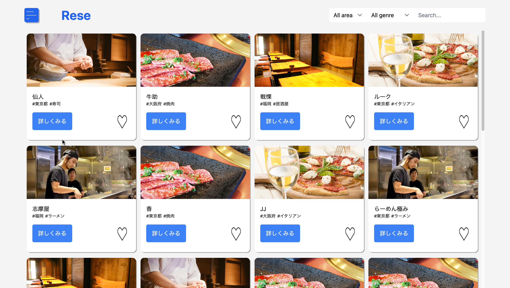
<h1>概要</h1>

ある企業グループ会社の飲食店予約サービス

<h1>githubリンク</h1>

https://github.com/NaoyaKatsumata/Rese_coachtech

<h1>機能</h1>
<ul>
    <li>会員登録</li>
    <li>ログイン</li>
    <li>ログアウト</li>
    <li>ユーザ情報取得</li>
    <li>ユーザ飲食店お気に入り一覧取得</li>
    <li>飲食店一覧取得</li>
    <li>飲食店詳細取得</li>
    <li>飲食店お気に入り追加</li>
    <li>飲食店お気に入り削除</li>
    <li>飲食店予約情報追加</li>
    <li>飲食店予約情報削除</li>
    <li>エリアで検索する</li>
    <li>ジャンルで検索する</li>
    <li>店名で検索する</li>
    <li>予約変更機能</li>
    <li>評価機能</li>
    <li>店舗情報編集</li>
    <li>店舗の追加</li>
    <li>メール送信機能</li>
    <li>リマインダー機能</li>
</ul>
<h1>使用技術</h1>
<ul>
    <li>laravel:9.52.16</li>
    <li>php:8.1.29</li>
    <li>Composer:2.7.7</li>
    <li>DB:MySQL</li>
</ul>
<h1>テーブル設計</h1>

areasテーブル

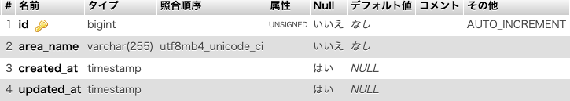

authoritiesテーブル

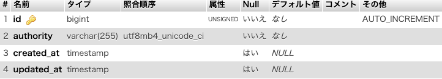

categoriesテーブル

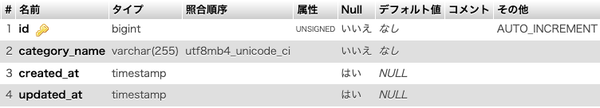

favoritesテーブル

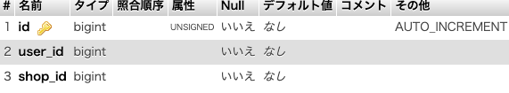

ownersテーブル

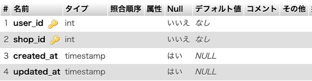

reservationsテーブル

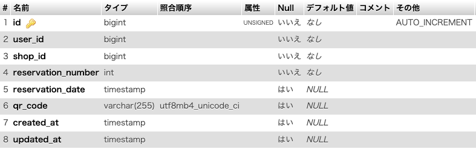

reviewsテーブル

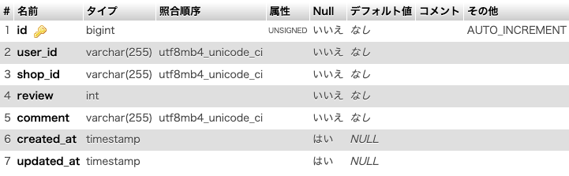

shopsテーブル

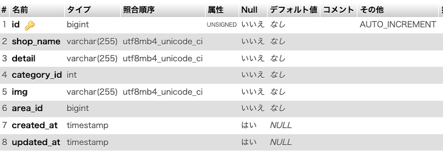

usersテーブル

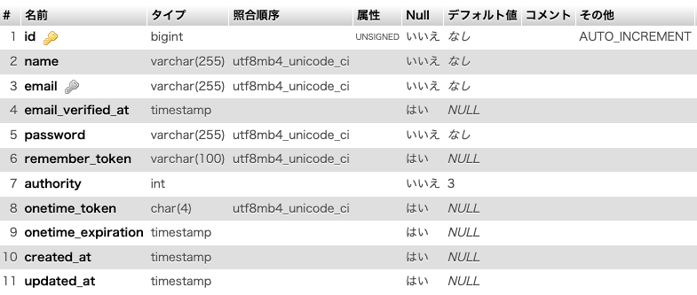
<h1>ER図</h1>
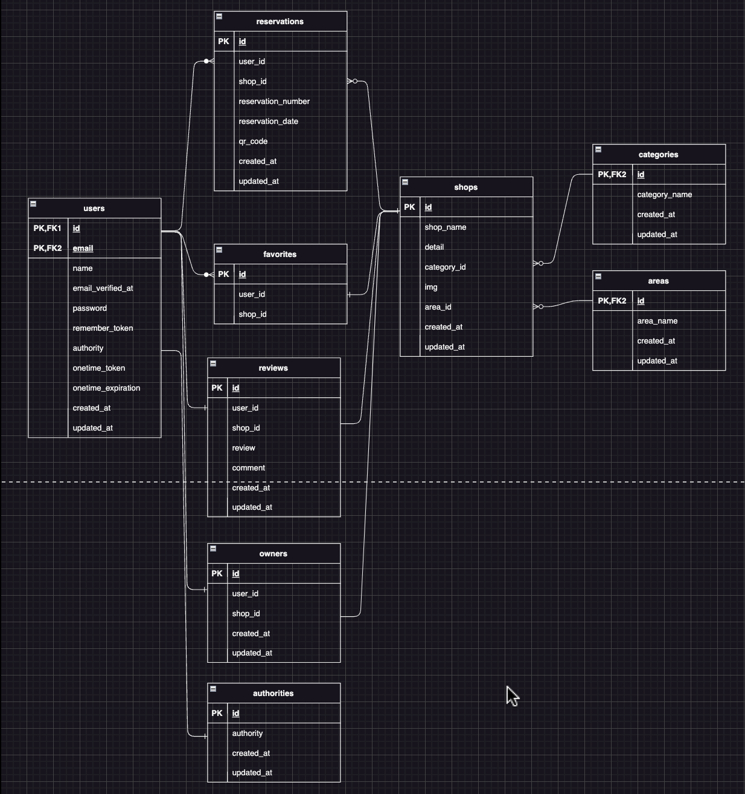
<h1>環境構築</h1>
<ol>
    <li>任意のフォルダに移動</li>
    <li>
        フォルダをローカルにclone 
        git@github.com:NaoyaKatsumata/Rese_coachtech.git
    </li>
    <li>
        docker-composeをビルド 
        docker-compose up -d --build
    </li>
    <li>
        composerのインストール 
        docker-compose exec php bash 
        composer install
    </li>
    <li>
        .envファイルの作成 
        cp .env.example .env 
        .envファイルの書き換え 
        DB_CONNECTION=mysql 
        DB_HOST=mysql 
        DB_PORT=3306 
        DB_DATABASE=laravel_db 
        DB_USERNAME=laravel_user 
        DB_PASSWORD=laravel_pass 
    </li>
    <li>
        dockerスタート
    </li>
    <li>
        phpコンテナにログイン 
        docker-compose exec php bash
    </li>
    <li>
        ダミーデータの投入 
        php artisan db:seed
    </li>
    <li>
        phpMyAdmin(localhost:8080)へアクセスし、管理者のメールアドレスを任意のものに変更 
        usersテーブル -> id 1 administratorの"email"を個人のメールアドレスに変更
    </li>
    <li>
        adminアカウントで一般ユーザとオーナーアカウントを作成 
        もしくは、usersテーブル -> id 2 ownerの"email"を個人のメールアドレスに変更 
        &emsp;&emsp;&emsp;&emsp;&emsp;&emsp;&emsp;&emsp;&emsp;&emsp;&emsp;&emsp;                    id 3 userの"email"を個人のメールアドレスに変更 
        (管理者はユーザの作成時に権限を付与、店舗の追加・編集、予約者へのお知らせメールの送信が可能 
        &nbsp;オーナーは自分の店舗の編集のみ可能、予約者へのお知らせメールの送信が可能 
        &nbsp;一般ユーザは店舗の予約、予約の変更・削除、店舗の評価が可能)
    </li>
</ol>